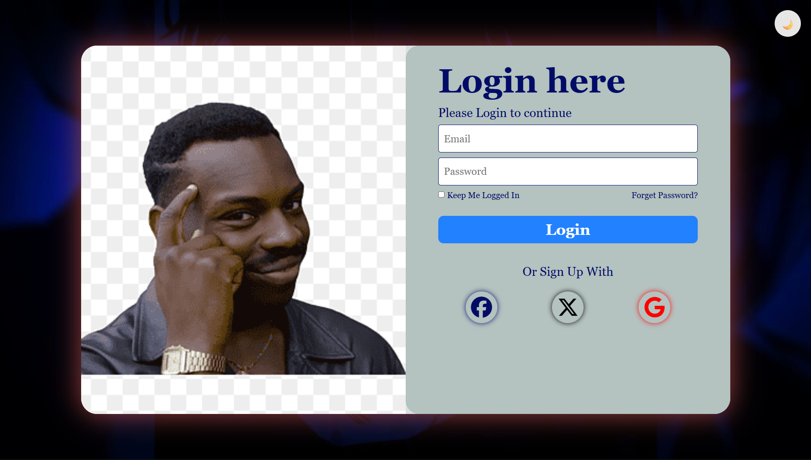

Login Page 🔐
A sleek, responsive, and modern Login Page built using pure HTML5 and CSS3 JAVASCRIPT. This project focuses on clean UI/UX design and mobile responsiveness.

🚀 Demo
You can view the live project here: [()]

✨ Features
Fully Responsive: Basically works on every device.

Modern UI: Uses CSS Flexbox/Grid for a centered, clean layout.

Interactive Elements: Includes hover effects on buttons and focus states on input fields.

Pure Code: No external frameworks or JavaScript libraries used—just raw HTML,CSS. and JAVASCRIPT.

🛠️ Built With
HTML5: For the semantic structure of the login form.

CSS3: For styling, animations, and layout.

JAVASCRIPT: For logic and interactivity.

Google Fonts: For clean typography.

📁 Project Structure

login-page/
│
├── index.html    # The main structure of the page
├── style.css     # The styling and layout rules
├── script.js     # The logic and interactivity.
└── assets/       # Folder for any images or icons used.

🤝 Contributing
Contributions are welcome! If you'd like to improve the design or add a feature (like a "Sign Up" toggle), feel free to fork the repo and create a pull request.

📝 License
This project is open source and available under the MIT License.
